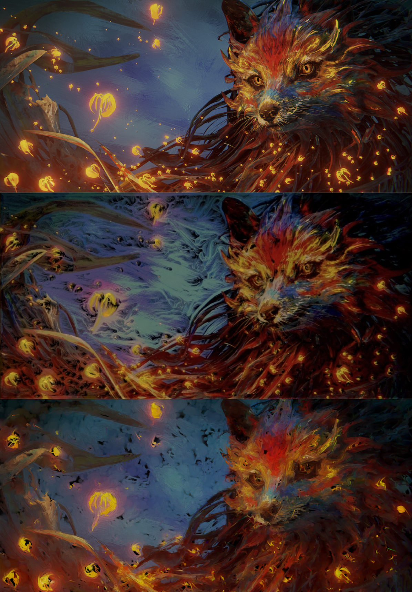

#  CS7GV3 - Real-Time Rendering -  Research Implementation

Top: Original image: Splash fox, designed and created by Daniel Bystedt.
Middle: Final frame from Lioret et al.
Bottom: Selected frame from my implementation.

Paper Chosen: Lioret, A. et al. (2021) ‘Procedural real time live drawing animation’, in Special Interest Group on Computer Graphics and Interactive Techniques Conference Posters. SIGGRAPH ’21: Special Interest Group on Computer Graphics and Interactive Techniques Conference, Virtual Event USA: ACM, pp. 1–2. Available at: https://doi.org/10.1145/3450618.3469141.
